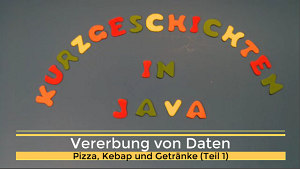

# Kurzgeschichten in Java

Hier findet man alle Programme die im Youtube Channel [Kurzgeschichten in Java](https://www.youtube.com/channel/UCquqDLOglqJxtZg1qqEwV0g) erstellt oder auch nur erklärt werden. 

**Warum ist der Code auf Deutsch?**
Da die Lernvideos alle das Ziel verfolgen Jugendlichen und Junggebliebenen Hilfe beim Erlernen von Java zu geben, sind Variablen-, Klassen- und Methodennamen hauptsächlich in Deutsch, obwohl das in der professionellen Softwareentwicklung äußerst ungewöhnlich ist. Ich habe mich trotzdem dazu entschieden, weil ich denke, dass es für viele junge angehende Code Junkies durchaus hilfreich ist. Die Umstellung auf Englisch zu einem späteren Zeitpunkt fällt dagegen vergleichsweise nicht schwer.

**Information for English visitors:**
This repository contains programs of my youtube channel [Kurzgeschichten in Java](https://www.youtube.com/channel/UCquqDLOglqJxtZg1qqEwV0g) (engl. "Short stories in Java"). Not only the videos, but also names of classes, methods and variables are in (Austrian) German. The channel is aiming to teach programming to young fellows and those which are young at heart. IMHO it may give an easier start by using German.

**I am fully aware that this is very unusual for software developers.** But I think, switching later to English coding and commenting is comparatively simple anyway.

[Thomas Schlögl](https://www.linkedin.com/in/thomas-schl%C3%B6gl-b6692a142)

# Liste aller Programme der Videos

|Verzeichnis|Themen|Video (aufs Bild draufklicken)|
|:---|:---|:---:|
|Pizza, Kebap und Getränke| *Vererbung, toString(), virtuelle und abstrakte Methoden, Polymorphie*||

# Have fun with all that stuff!
